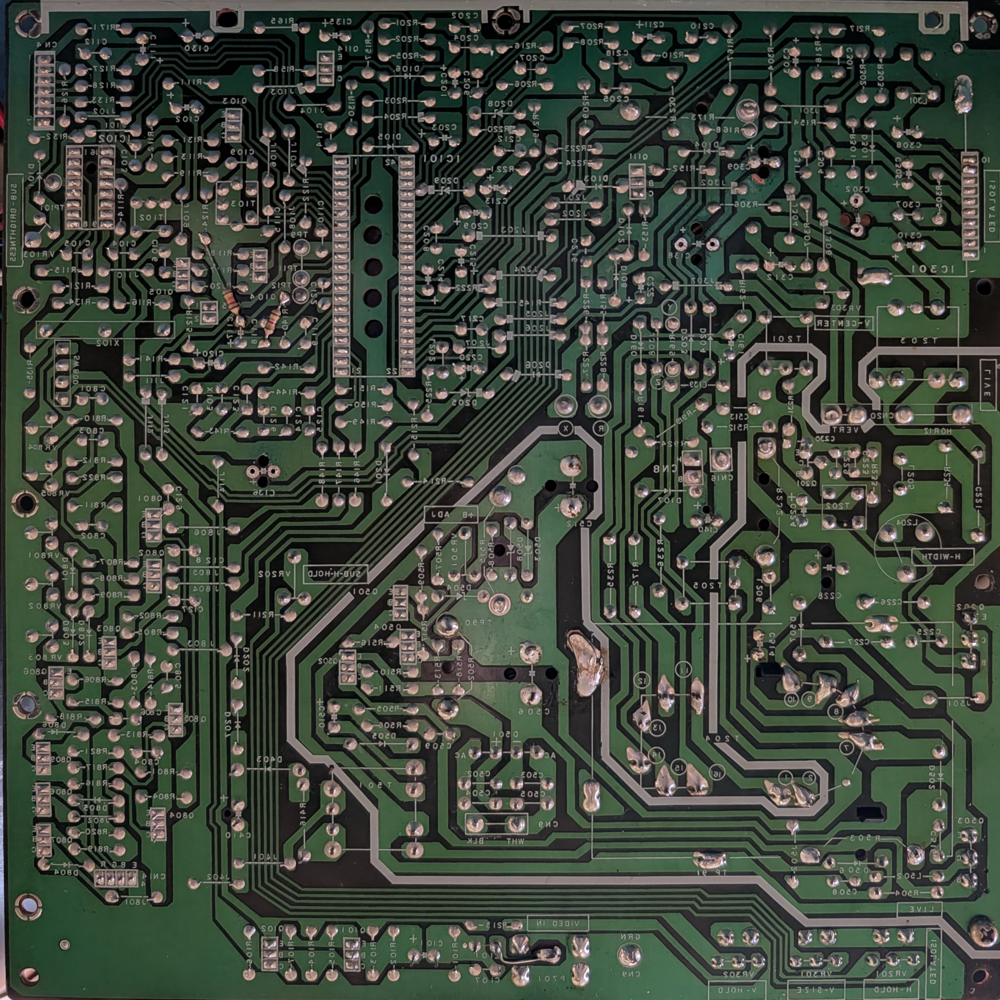
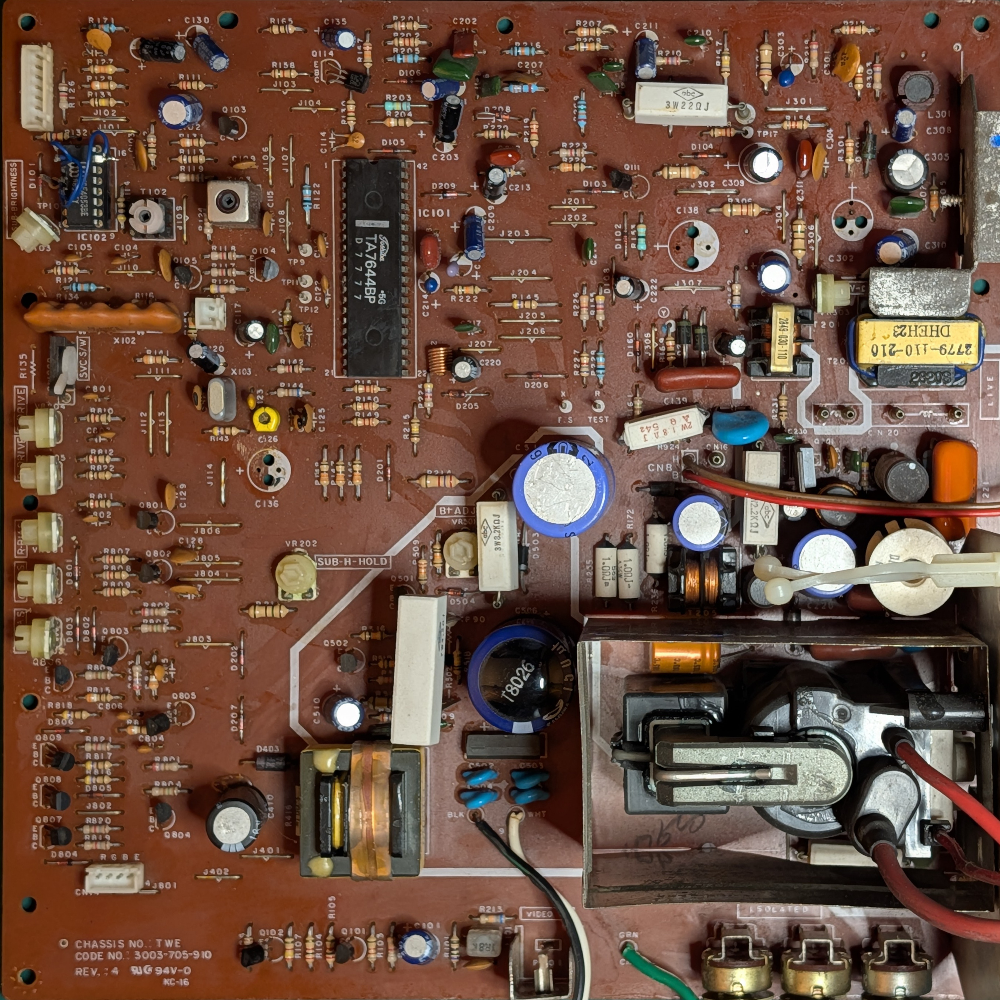
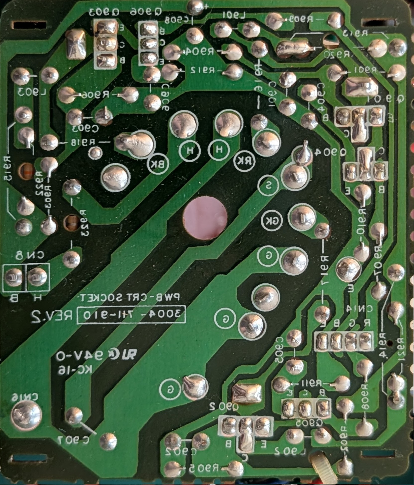
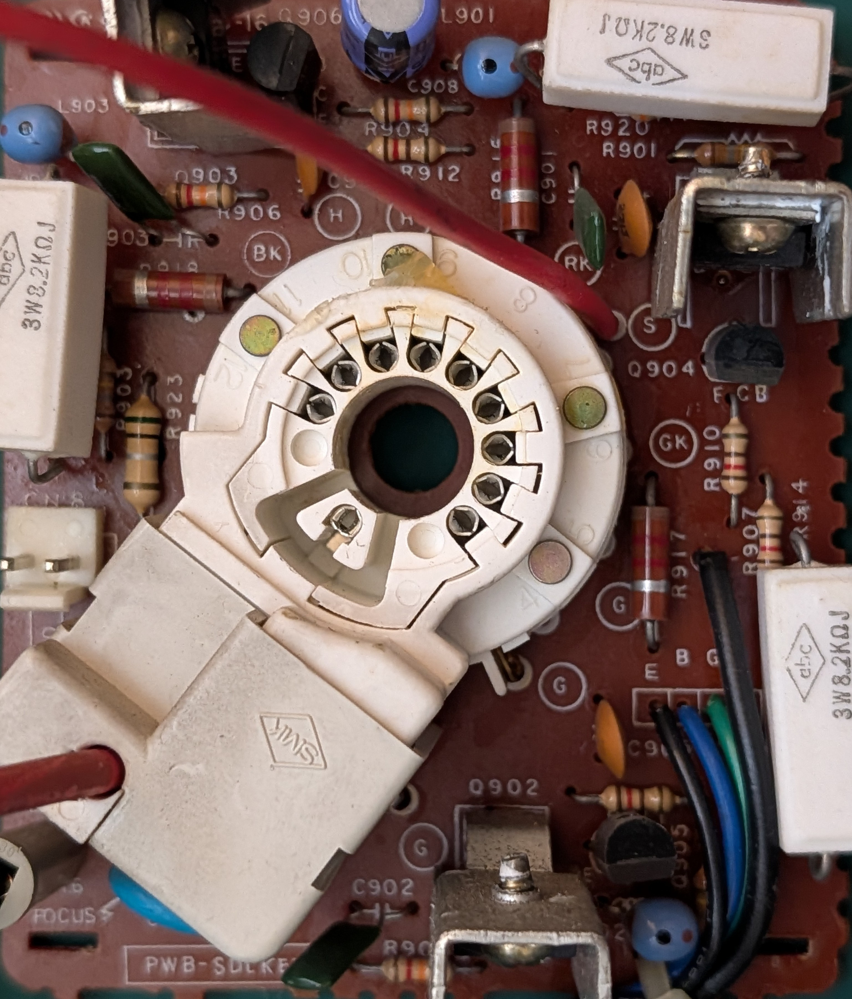
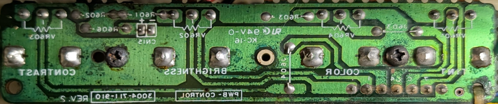

# Apple ColorMonitor IIe (A2M2056) "S Series"

KiCad schematic, reverse-engineered by Fred Sauer in 2026.

CHASSIS NO.: `TWE 3003-705-910`, REV: `4`

KiCad schematic can be found in the `KiCad/` folder.

<hr>


<table>
  <caption>KiCad schematic</caption>
  <tr>
    <td>
      <a href="apple-color-monitor-iie-a2m2056.svg">apple-color-monitor-iie-a2m2056.svg</a><br>
      <a href="apple-color-monitor-iie-a2m2056.pdf">apple-color-monitor-iie-a2m2056.pdf</a><br>
    </td>
  </tr>
  <tr>
    <td></td>
  </tr>
</table>

<table>
  <caption>Main circuit board (245 x 245 mm)</caption>
  <tr>
    <td>Bottom side (flipped)</td>
    <td>Top side</td>
  </tr>
  <tr>
    <td></td>
    <td></td>
  </tr>
</table>

<table>
  <caption>Neck circuit board (72 x 85 mm)</caption>
  <tr>
    <td>Bottom side (flipped)</td>
    <td>Top side</td>
  </tr>
  <tr>
    <td></td>
    <td></td>
  </tr>
</table>

<table>
  <caption>Front panel control circuit board (132 x 28 mm)</caption>
  <tr>
    <td>Bottom side (flipped)</td>
    <td>Top side</td>
  </tr>
  <tr>
    <td></td>
    <td>(top side image not available)</td>
  </tr>
</table>


Model number `A2M2056`


Specifications, per Apple® ColorMonitor Installation Manual:

```
Picture Tube              14-inch diagonal (13-inch view)
                          0.52 mm slot pitch
                          High contrast (black matrix)

Input Signal              Composite-only sync negative 1.0 ± .5 volts peak to
                          peak, internally terminated with 75 ohm resistor


User Controls             Front power switch
                          Contrast
                          Brightness
                          Color
                          Tint
                          White Only button
                          Vertical height (back)
                          Vertical hold (back)
                          Horizontal hold (back)

Scanning Frequencies      NTSC/60           NTSC/50
Horizontal                15.734 kHz        15.659 kHz
Vertical                  60 Hz             50 Hz

Color Reference Frequency
                          NTSC/60 Hz        NTSC/50 Hz
                          3.579545 MHz      3.562456 MHz
Video Bandwidth
                          NTSC
Text (Monochrome)         8.0 MHz
Graphics (Color)          3.0MHz

Weight                    12.5 kg (27 .56 lbs) maximum
Power Requirement         50 watts under normal viewing conditions;
                          75 watts maximum

Input Voltage Model       Operating Range    Power Frequency
120 v                     108-132            50-60 Hz
220 v                     198-242            50-60 Hz
240 v                     216-264            50-60 Hz

Note: Input voltage is not adjustable within the monitor.

Operating Ambient Temperature        0°C to 50°C

Fuse Protection

The monitor contains internal power line fuse
protection. This fuse should be replaced with the same
type by a qualified service technician.

```
